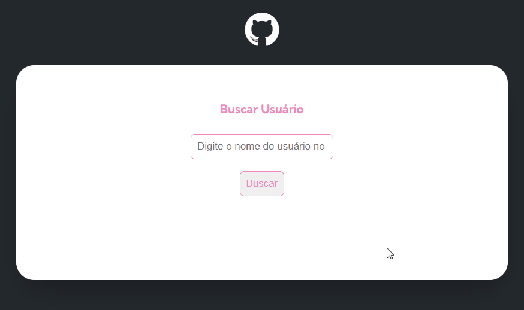

# Projeto API GitHub

Projeto desenvolvido consumindo a API do GitHub. O intuito é buscar informações de usuários do GitHub. 
No sistema é possível fazer a busca pelos usuários e na tela aparecem algumas informações de perfil, repositórios e últimos eventos deste usuário. 

[]

## Meu processo

### Tecnologias utilizadas

- HTML
- CSS
- JavaScript

### O que aprendi

Trabalhando com a API, posso destacar desde a importância de entender melhor uma documentação, até o momento de fazer sua requisição com o método fetch. A separação de cada uma das responsabilidades, para uma boa leitura e oraganização do código. Também quero ressaltar que foi essencial o uso de módulos para o desenvolvimento desse projeto. 